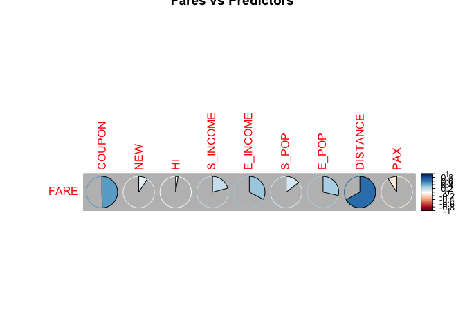
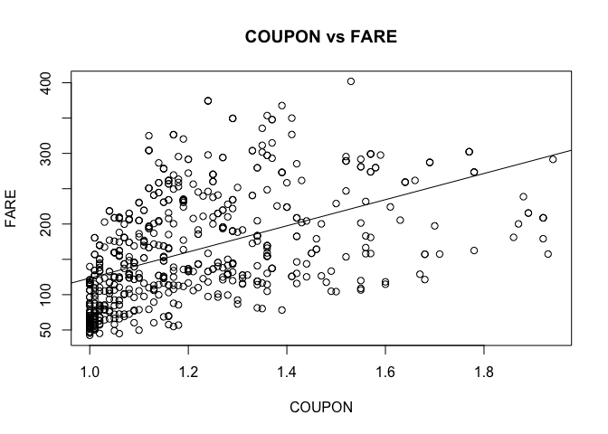
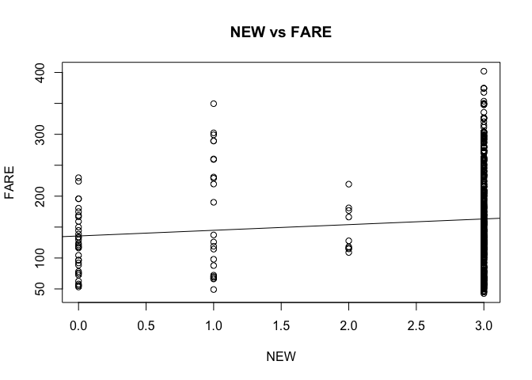
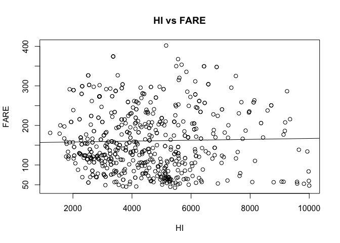
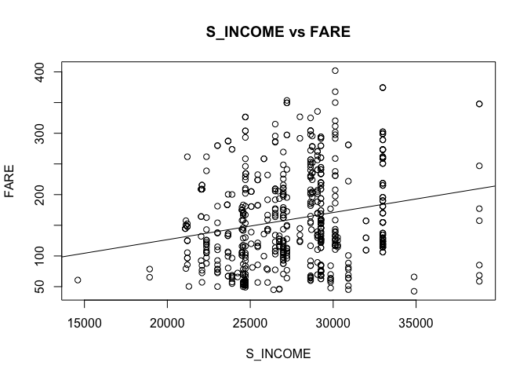
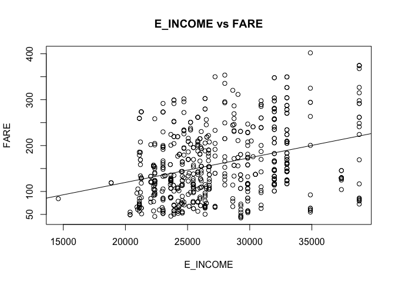
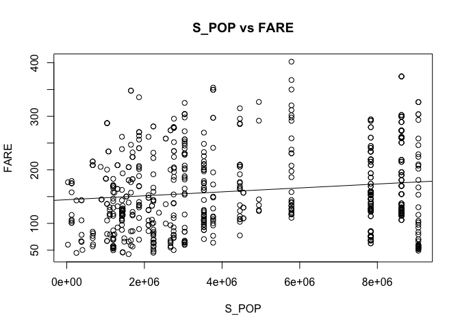
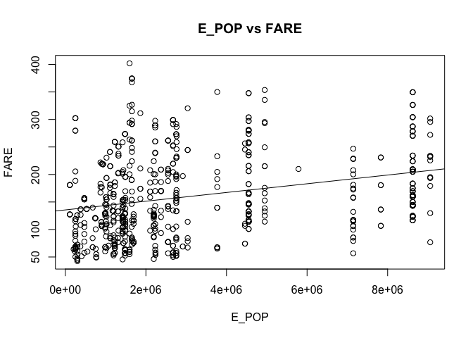
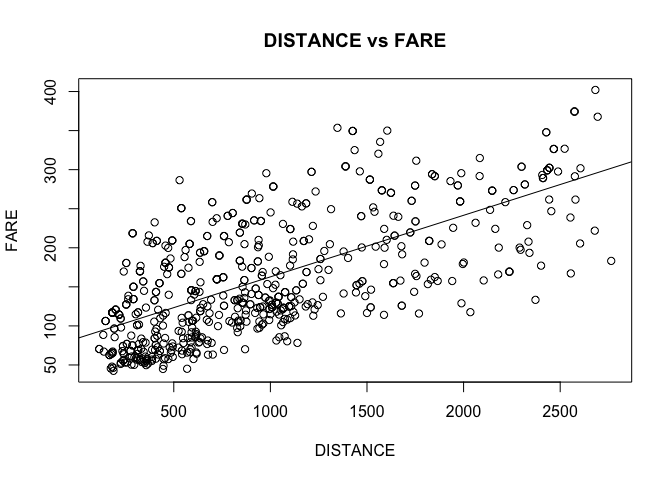
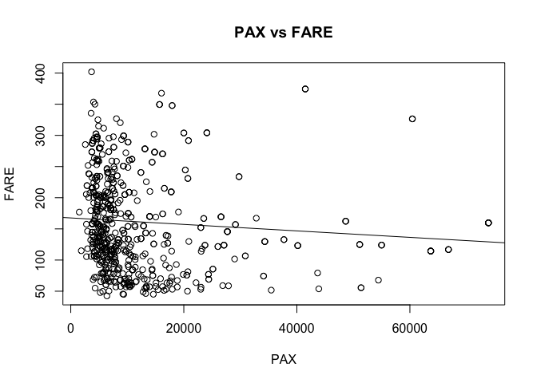

Prediction of Airfares using various regression techniques
================
Manoj Bhandari

-----

Load the required packages to workspace

``` r
if(!require("pacman")) install.packages("pacman")
pacman::p_load(data.table, forecast, leaps, dplyr, corrplot, tinytex, 
               ggplot2, tidyr, stats)
```

-----

# Create a correlation table and scatterplots between FARE and the predictors to check what seems to be the best single predictor of FARE.

``` r
library(data.table, corrplot)
raw.data <- fread("Airfares.csv")
d <- setDF(raw.data[, !1:4])
num.ind <- unlist(lapply(d, is.numeric))
numeric.data <- d[,num.ind]
```

**Displayed below is the correlation table between FARE and other
predictors**

``` r
corrplot(cor(numeric.data)[10, -10,drop = FALSE], method = "pie", bg = "grey", 
        title = "Fares vs Predictors")
```

<!-- -->

**Displayed below is the scatter plot matrix between various
predictors**

``` r
library(stats)

plot(d$COUPON,d$FARE, xlab = "COUPON", ylab = "FARE", main = "COUPON vs FARE")
abline(lm(d$FARE~d$COUPON))
```

<!-- -->

``` r
plot(d$NEW,d$FARE, xlab = "NEW", ylab = "FARE", main = "NEW vs FARE")
abline(lm(d$FARE~d$NEW))
```

<!-- -->

``` r
plot(d$HI,d$FARE, xlab = "HI", ylab = "FARE", main = "HI vs FARE")
abline(lm(d$FARE~d$HI))
```

<!-- -->

``` r
plot(d$S_INCOME,d$FARE, xlab = "S_INCOME", ylab = "FARE", main = "S_INCOME vs FARE")
abline(lm(d$FARE~d$S_INCOME))
```

<!-- -->

``` r
plot(d$E_INCOME,d$FARE, xlab = "E_INCOME", ylab = "FARE", main = "E_INCOME vs FARE")
abline(lm(d$FARE~d$E_INCOME))
```

<!-- -->

``` r
plot(d$S_POP,d$FARE, xlab = "S_POP", ylab = "FARE", main = "S_POP vs FARE")
abline(lm(d$FARE~d$S_POP))
```

<!-- -->

``` r
plot(d$E_POP,d$FARE, xlab = "E_POP", ylab = "FARE", main = "E_POP vs FARE")
abline(lm(d$FARE~d$E_POP))
```

<!-- -->

``` r
plot(d$DISTANCE,d$FARE, xlab = "DISTANCE", ylab = "FARE", main = "DISTANCE vs FARE")
abline(lm(d$FARE~d$DISTANCE))
```

<!-- -->

``` r
plot(d$PAX,d$FARE, xlab = "PAX", ylab = "FARE", main = "PAX vs FARE")
abline(lm(d$FARE~d$PAX))
```

<!-- -->

**DISTANCE seems to be the single best predictor because of the
following reasons:**

1.  From the correlation table, we observe that the correltion between
    FARE and DISTANCE has a strong positive relationship when compared
    to other predictors.
2.  Even logically, as the DISTANCE increases, the FARE usually
    increases to adjust the fuel price and other
factors.

-----

-----

# Explore the categorical predictors by computing the percentage of flights in each category and create a pivot table with the average fare in each category to check which categorical predictor seems best for predicting FARE.

**Calculate the average mean of the FARE from the dataset to be compared
with various categorical predictors**

``` r
library(dplyr,tidyr)
avg <- mean(d$FARE)
count <- nrow(d)
```

**Pivot Table of SW vs FARE**

``` r
pivot1 <- d %>%
select(SW,FARE) %>%
group_by(SW) %>%
summarise(Percentage_Of_Flights = (length(SW)/count) * 100,
Average_Fares_SW = mean(FARE), 
Variation_From_Average = mean(FARE) - avg)
knitr::kable(pivot1, caption = "SW vs FARE")
```

| SW  | Percentage\_Of\_Flights | Average\_Fares\_SW | Variation\_From\_Average |
| :-- | ----------------------: | -----------------: | -----------------------: |
| No  |                69.59248 |          188.18279 |                 27.30612 |
| Yes |                30.40752 |           98.38227 |               \-62.49441 |

SW vs FARE

**Pivot Table of VACATION vs FARE**

``` r
pivot2 <- d %>%
  select(VACATION, FARE) %>%
  group_by(VACATION) %>%
  summarise(Percentage_Of_Flights = (length(VACATION)/count) * 100,
            Average_Fares_VACATION = mean(FARE),
            Variation_From_Average = mean(FARE) - avg)
knitr::kable(pivot2, caption = "VACATION vs FARE")
```

| VACATION | Percentage\_Of\_Flights | Average\_Fares\_VACATION | Variation\_From\_Average |
| :------- | ----------------------: | -----------------------: | -----------------------: |
| No       |                73.35423 |                 173.5525 |                 12.67582 |
| Yes      |                26.64577 |                 125.9809 |               \-34.89579 |

VACATION vs FARE

**Pivot Table of GATE vs FARE**

``` r
pivot3 <- d %>%
  select(GATE, FARE) %>%
  group_by(GATE) %>%
  summarise(Percentage_Of_Flights = (length(GATE)/count) * 100,
            Average_Fares_GATE = mean(FARE),
            Variation_From_Average = mean(FARE) - avg)
knitr::kable(pivot3, caption = "GATE vs FARE")
```

| GATE        | Percentage\_Of\_Flights | Average\_Fares\_GATE | Variation\_From\_Average |
| :---------- | ----------------------: | -------------------: | -----------------------: |
| Constrained |                19.43574 |              193.129 |                32.252355 |
| Free        |                80.56426 |              153.096 |               \-7.780724 |

GATE vs FARE

**Pivot Table of SLOT vs FARE**

``` r
pivot4 <- d %>%
  select(SLOT, FARE) %>%
  group_by(SLOT) %>%
  summarise(Percentage_Of_Flights = (length(SLOT)/count) * 100,
            Average_Fares_SLOT = mean(FARE),
            Variation_From_Average = mean(FARE) - avg)
knitr::kable(pivot4, caption = "SLOT vs FARE")
```

| SLOT       | Percentage\_Of\_Flights | Average\_Fares\_SLOT | Variation\_From\_Average |
| :--------- | ----------------------: | -------------------: | -----------------------: |
| Controlled |                28.52665 |             186.0594 |                 25.18272 |
| Free       |                71.47335 |             150.8257 |               \-10.05100 |

SLOT vs FARE

**The avaerage FARE of the data set is ** **From all the pivot tables,
we observe the following:**

1.  When SW = Yes, i.e., when Southwest airlines serves the route, we
    can see a great variation in the FARE with respect to average FARE.
    The average FARES decreases significantly when Southwest serves that
    route.
2.  When SW = No, i.e., when Sothwest airlines does not serve that
    route, the FARES are usually higher than the usual average FARE

**We can infer that operation of Southwest airlines in a particular
route serves in predicting the FARES.**

-----

-----

**Splitting 80% of data into training dataset and 20% of remaining data
into test/validation dataset**

``` r
library(stats)
set.seed(42)
sample <- sample.int(n = nrow(d), size = round(.80*nrow(d)))
train <- d[sample, ]
test  <- d[-sample, ]
```

**Running a linear regression on the training dataset and printing the
summary of Linear Regression**

``` r
lin.model <- lm(FARE ~., data = train)
options(scipen = 999)
summary(lin.model)
```

    ## 
    ## Call:
    ## lm(formula = FARE ~ ., data = train)
    ## 
    ## Residuals:
    ##     Min      1Q  Median      3Q     Max 
    ## -99.282 -23.384  -2.476  22.156 106.501 
    ## 
    ## Coefficients:
    ##                   Estimate     Std. Error t value             Pr(>|t|)    
    ## (Intercept)  13.8781441835  30.7076946550   0.452             0.651507    
    ## COUPON       11.6744988371  13.6949175687   0.852             0.394365    
    ## NEW          -2.2468005921   2.0827213457  -1.079             0.281210    
    ## VACATIONYes -37.8385127965   3.9788129464  -9.510 < 0.0000000000000002 ***
    ## SWYes       -38.9566477546   4.2526101838  -9.161 < 0.0000000000000002 ***
    ## HI            0.0085414832   0.0010936608   7.810   0.0000000000000343 ***
    ## S_INCOME      0.0006160967   0.0005709965   1.079             0.281119    
    ## E_INCOME      0.0015472928   0.0004141497   3.736             0.000209 ***
    ## S_POP         0.0000040087   0.0000007411   5.409   0.0000000987167149 ***
    ## E_POP         0.0000039572   0.0000008329   4.751   0.0000026562530825 ***
    ## SLOTFree    -16.4322948237   4.3647846605  -3.765             0.000187 ***
    ## GATEFree    -21.1634823059   4.4093579183  -4.800   0.0000021065804690 ***
    ## DISTANCE      0.0715673994   0.0039223121  18.246 < 0.0000000000000002 ***
    ## PAX          -0.0007340587   0.0001662490  -4.415   0.0000123830100844 ***
    ## ---
    ## Signif. codes:  0 '***' 0.001 '**' 0.01 '*' 0.05 '.' 0.1 ' ' 1
    ## 
    ## Residual standard error: 35.41 on 496 degrees of freedom
    ## Multiple R-squared:  0.7817, Adjusted R-squared:  0.7759 
    ## F-statistic: 136.6 on 13 and 496 DF,  p-value: < 0.00000000000000022

-----

-----

# Using leaps package, run stepwise regression to reduce the number of predictors.

``` r
fare.stepwise.reg <- step(lin.model, direction = "both")
```

    ## Start:  AIC=3652.06
    ## FARE ~ COUPON + NEW + VACATION + SW + HI + S_INCOME + E_INCOME + 
    ##     S_POP + E_POP + SLOT + GATE + DISTANCE + PAX
    ## 
    ##            Df Sum of Sq     RSS    AIC
    ## - COUPON    1       911  622732 3650.8
    ## - NEW       1      1459  623280 3651.3
    ## - S_INCOME  1      1460  623281 3651.3
    ## <none>                   621821 3652.1
    ## - E_INCOME  1     17499  639320 3664.2
    ## - SLOT      1     17769  639590 3664.4
    ## - PAX       1     24441  646263 3669.7
    ## - E_POP     1     28296  650118 3672.8
    ## - GATE      1     28881  650702 3673.2
    ## - S_POP     1     36680  658501 3679.3
    ## - HI        1     76469  698290 3709.2
    ## - SW        1    105205  727026 3729.8
    ## - VACATION  1    113382  735204 3735.5
    ## - DISTANCE  1    417379 1039200 3912.0
    ## 
    ## Step:  AIC=3650.81
    ## FARE ~ NEW + VACATION + SW + HI + S_INCOME + E_INCOME + S_POP + 
    ##     E_POP + SLOT + GATE + DISTANCE + PAX
    ## 
    ##            Df Sum of Sq     RSS    AIC
    ## - S_INCOME  1      1261  623994 3649.8
    ## - NEW       1      1678  624410 3650.2
    ## <none>                   622732 3650.8
    ## + COUPON    1       911  621821 3652.1
    ## - E_INCOME  1     17126  639859 3662.6
    ## - SLOT      1     18407  641139 3663.7
    ## - GATE      1     29285  652018 3672.2
    ## - E_POP     1     29484  652217 3672.4
    ## - PAX       1     34128  656860 3676.0
    ## - S_POP     1     36089  658821 3677.5
    ## - HI        1     78594  701326 3709.4
    ## - SW        1    107735  730468 3730.2
    ## - VACATION  1    114276  737009 3734.7
    ## - DISTANCE  1    824468 1447200 4078.9
    ## 
    ## Step:  AIC=3649.84
    ## FARE ~ NEW + VACATION + SW + HI + E_INCOME + S_POP + E_POP + 
    ##     SLOT + GATE + DISTANCE + PAX
    ## 
    ##            Df Sum of Sq     RSS    AIC
    ## - NEW       1      1697  625690 3649.2
    ## <none>                   623994 3649.8
    ## + S_INCOME  1      1261  622732 3650.8
    ## + COUPON    1       713  623281 3651.3
    ## - E_INCOME  1     16167  640161 3660.9
    ## - SLOT      1     20012  644006 3663.9
    ## - E_POP     1     28559  652552 3670.7
    ## - GATE      1     29766  653759 3671.6
    ## - PAX       1     32869  656863 3674.0
    ## - S_POP     1     41722  665715 3680.8
    ## - HI        1     79501  703495 3709.0
    ## - SW        1    126837  750831 3742.2
    ## - VACATION  1    128080  752073 3743.1
    ## - DISTANCE  1    826967 1450960 4078.2
    ## 
    ## Step:  AIC=3649.22
    ## FARE ~ VACATION + SW + HI + E_INCOME + S_POP + E_POP + SLOT + 
    ##     GATE + DISTANCE + PAX
    ## 
    ##            Df Sum of Sq     RSS    AIC
    ## <none>                   625690 3649.2
    ## + NEW       1      1697  623994 3649.8
    ## + S_INCOME  1      1280  624410 3650.2
    ## + COUPON    1       907  624783 3650.5
    ## - E_INCOME  1     15649  641339 3659.8
    ## - SLOT      1     19217  644907 3662.6
    ## - E_POP     1     28766  654456 3670.1
    ## - GATE      1     29165  654856 3670.5
    ## - PAX       1     32706  658396 3673.2
    ## - S_POP     1     42648  668338 3680.9
    ## - HI        1     78891  704581 3707.8
    ## - SW        1    126577  752267 3741.2
    ## - VACATION  1    127066  752756 3741.5
    ## - DISTANCE  1    825966 1451656 4076.4

``` r
summary(fare.stepwise.reg)
```

    ## 
    ## Call:
    ## lm(formula = FARE ~ VACATION + SW + HI + E_INCOME + S_POP + E_POP + 
    ##     SLOT + GATE + DISTANCE + PAX, data = train)
    ## 
    ## Residuals:
    ##     Min      1Q  Median      3Q     Max 
    ## -99.148 -22.077  -2.028  21.491 107.744 
    ## 
    ## Coefficients:
    ##                   Estimate     Std. Error t value             Pr(>|t|)    
    ## (Intercept)  42.0764345686  14.7566725244   2.851             0.004534 ** 
    ## VACATIONYes -38.7574569132   3.8500841929 -10.067 < 0.0000000000000002 ***
    ## SWYes       -40.5282166043   4.0337560764 -10.047 < 0.0000000000000002 ***
    ## HI            0.0082681499   0.0010423739   7.932   0.0000000000000143 ***
    ## E_INCOME      0.0014446281   0.0004089281   3.533             0.000450 ***
    ## S_POP         0.0000041850   0.0000007176   5.832   0.0000000098509604 ***
    ## E_POP         0.0000037791   0.0000007890   4.790   0.0000022053722984 ***
    ## SLOTFree    -16.8515659965   4.3045728245  -3.915             0.000103 ***
    ## GATEFree    -21.2165142735   4.3991611435  -4.823   0.0000018824635124 ***
    ## DISTANCE      0.0736714582   0.0028704349  25.666 < 0.0000000000000002 ***
    ## PAX          -0.0007619280   0.0001491869  -5.107   0.0000004660838631 ***
    ## ---
    ## Signif. codes:  0 '***' 0.001 '**' 0.01 '*' 0.05 '.' 0.1 ' ' 1
    ## 
    ## Residual standard error: 35.41 on 499 degrees of freedom
    ## Multiple R-squared:  0.7803, Adjusted R-squared:  0.7759 
    ## F-statistic: 177.2 on 10 and 499 DF,  p-value: < 0.00000000000000022

``` r
fare.stepwise.pred <- predict(fare.stepwise.reg, test)
```

## Analysis of the summary:

**The observations of the stepwise regressions are as below:**

1.  Initial number of predictors = 13
2.  Final number of predictors after running Stepwise linear regression
    = 10
3.  Three of the predictors, *NEW*, *S\_INCOME* and *COUPON* were
    discarded by the
regression

-----

-----

# Repeat the process in (4) using exhaustive search instead of stepwise regression to compare the resulting best model to the one you obtained in (4) in terms of the predictors included in the final model.

Running the exhaustive search and storing the summary of serahc results
in variable
*sum*

``` r
search <- regsubsets(FARE ~ ., data = train, nbest = 1, nvmax = dim(train)[2],
                     method = "exhaustive")
sum <- summary(search)
```

``` r
res <- data.frame(
  Adjusted.Rsquare = which.max(sum$adjr2),
  CP = which.min(sum$cp),
  BIC = which.min(sum$bic)
)
ind <- min(res)
sum$which
```

    ##    (Intercept) COUPON   NEW VACATIONYes SWYes    HI S_INCOME E_INCOME
    ## 1         TRUE  FALSE FALSE       FALSE FALSE FALSE    FALSE    FALSE
    ## 2         TRUE  FALSE FALSE       FALSE  TRUE FALSE    FALSE    FALSE
    ## 3         TRUE  FALSE FALSE        TRUE  TRUE FALSE    FALSE    FALSE
    ## 4         TRUE  FALSE FALSE        TRUE  TRUE  TRUE    FALSE    FALSE
    ## 5         TRUE  FALSE FALSE        TRUE  TRUE  TRUE    FALSE    FALSE
    ## 6         TRUE  FALSE FALSE        TRUE  TRUE  TRUE    FALSE    FALSE
    ## 7         TRUE  FALSE FALSE        TRUE  TRUE  TRUE    FALSE    FALSE
    ## 8         TRUE  FALSE FALSE        TRUE  TRUE  TRUE    FALSE     TRUE
    ## 9         TRUE  FALSE FALSE        TRUE  TRUE  TRUE    FALSE    FALSE
    ## 10        TRUE  FALSE FALSE        TRUE  TRUE  TRUE    FALSE     TRUE
    ## 11        TRUE  FALSE  TRUE        TRUE  TRUE  TRUE    FALSE     TRUE
    ## 12        TRUE  FALSE  TRUE        TRUE  TRUE  TRUE     TRUE     TRUE
    ## 13        TRUE   TRUE  TRUE        TRUE  TRUE  TRUE     TRUE     TRUE
    ##    S_POP E_POP SLOTFree GATEFree DISTANCE   PAX
    ## 1  FALSE FALSE    FALSE    FALSE     TRUE FALSE
    ## 2  FALSE FALSE    FALSE    FALSE     TRUE FALSE
    ## 3  FALSE FALSE    FALSE    FALSE     TRUE FALSE
    ## 4  FALSE FALSE    FALSE    FALSE     TRUE FALSE
    ## 5  FALSE FALSE     TRUE    FALSE     TRUE FALSE
    ## 6  FALSE FALSE     TRUE     TRUE     TRUE FALSE
    ## 7   TRUE  TRUE    FALSE    FALSE     TRUE  TRUE
    ## 8   TRUE  TRUE    FALSE    FALSE     TRUE  TRUE
    ## 9   TRUE  TRUE     TRUE     TRUE     TRUE  TRUE
    ## 10  TRUE  TRUE     TRUE     TRUE     TRUE  TRUE
    ## 11  TRUE  TRUE     TRUE     TRUE     TRUE  TRUE
    ## 12  TRUE  TRUE     TRUE     TRUE     TRUE  TRUE
    ## 13  TRUE  TRUE     TRUE     TRUE     TRUE  TRUE

``` r
sum$rsq
```

    ##  [1] 0.4168069 0.5793894 0.6966218 0.7232479 0.7366555 0.7565835 0.7607777
    ##  [8] 0.7674947 0.7748171 0.7803115 0.7809073 0.7813501 0.7816700

``` r
sum$adjr2
```

    ##  [1] 0.4156589 0.5777302 0.6948231 0.7210558 0.7340429 0.7536799 0.7574419
    ##  [8] 0.7637820 0.7707638 0.7759090 0.7760679 0.7760708 0.7759476

``` r
sum$cp
```

    ##  [1] 818.89220 451.53899 187.21153 128.72255 100.26346  56.99127  49.46286
    ##  [8]  36.20326  21.56831  11.08605  11.73270  12.72670  14.00000

**From the values of R-Squared, Adjusted R-Squared and CP, we can see
that CP gives us the best model as after 10 variables, other variables
start being insignificant. So we will consider the model with 10
variables as our best model**

``` r
myres <- as.vector(sum$which[ind,2:ncol(train)])
best_variables <- train[,myres]
best_model <- cbind(best_variables, FARE = train$FARE)
blm <- lm(FARE ~. , data = best_model)
summary(blm)
```

    ## 
    ## Call:
    ## lm(formula = FARE ~ ., data = best_model)
    ## 
    ## Residuals:
    ##     Min      1Q  Median      3Q     Max 
    ## -99.148 -22.077  -2.028  21.491 107.744 
    ## 
    ## Coefficients:
    ##                   Estimate     Std. Error t value             Pr(>|t|)    
    ## (Intercept)  42.0764345686  14.7566725244   2.851             0.004534 ** 
    ## VACATIONYes -38.7574569132   3.8500841929 -10.067 < 0.0000000000000002 ***
    ## SWYes       -40.5282166043   4.0337560764 -10.047 < 0.0000000000000002 ***
    ## HI            0.0082681499   0.0010423739   7.932   0.0000000000000143 ***
    ## E_INCOME      0.0014446281   0.0004089281   3.533             0.000450 ***
    ## S_POP         0.0000041850   0.0000007176   5.832   0.0000000098509604 ***
    ## E_POP         0.0000037791   0.0000007890   4.790   0.0000022053722984 ***
    ## SLOTFree    -16.8515659965   4.3045728245  -3.915             0.000103 ***
    ## GATEFree    -21.2165142735   4.3991611435  -4.823   0.0000018824635124 ***
    ## DISTANCE      0.0736714582   0.0028704349  25.666 < 0.0000000000000002 ***
    ## PAX          -0.0007619280   0.0001491869  -5.107   0.0000004660838631 ***
    ## ---
    ## Signif. codes:  0 '***' 0.001 '**' 0.01 '*' 0.05 '.' 0.1 ' ' 1
    ## 
    ## Residual standard error: 35.41 on 499 degrees of freedom
    ## Multiple R-squared:  0.7803, Adjusted R-squared:  0.7759 
    ## F-statistic: 177.2 on 10 and 499 DF,  p-value: < 0.00000000000000022

``` r
fare.best.pred <- predict(blm, test)
accuracy(fare.best.pred, test$FARE)
```

    ##               ME    RMSE      MAE       MPE     MAPE
    ## Test set 3.06081 36.8617 27.70568 -5.938062 21.62142

**When we compare the resulting best model of exhaustive search with the
model generated by the stepwise regression, we can observe that the
predictive accuracy of both the models are identical.** ***
***

# Compare the predictive accuracy of both models—stepwise regression and exhaustive search—using measures such as RMSE.

``` r
accuracy(fare.stepwise.pred, test$FARE)
```

    ##               ME    RMSE      MAE       MPE     MAPE
    ## Test set 3.06081 36.8617 27.70568 -5.938062 21.62142

``` r
accuracy(fare.best.pred, test$FARE)
```

    ##               ME    RMSE      MAE       MPE     MAPE
    ## Test set 3.06081 36.8617 27.70568 -5.938062 21.62142

**The predictive accuracy of both Stepwise regression and Exhaustive
search is
identical**

-----

-----

# Using the exhaustive search model, let us predict the average fare on a route with the following characteristics: COUPON = 1.202, NEW = 3, VACATION = No, SW = No, HI = 4442.141, S\_INCOME = $28,760, E\_INCOME = $27,664, S\_POP = 4,557,004, E\_POP = 3,195,503, SLOT = Free, GATE = Free, PAX = 12,782, DISTANCE = 1976 miles.

``` r
data.pred <- data.frame(COUPON = 1.202, NEW = 3, VACATION = 'No', SW = 'No', HI = 4442.141,
                        S_INCOME = 28760, E_INCOME = 27664, S_POP = 4557004, E_POP = 3195503,
                        SLOT = 'Free', GATE = 'Free', PAX = 12782, DISTANCE = 1976)
prediction <- predict(blm, data.pred)
```

**The predicted value with ‘SW = No’ is -\> 247.6839836** ***
***

# Let us predict the reduction in average fare on the route in previous step, if Southwest decides to cover this route \[using the exhaustive search model above\].

``` r
data.pred1 <- data.frame(COUPON = 1.202, NEW = 3, VACATION = 'No', SW = 'Yes', HI = 4442.141,
                        S_INCOME = 28760, E_INCOME = 27664, S_POP = 4557004, E_POP = 3195503,
                        SLOT = 'Free', GATE = 'Free', PAX = 12782, DISTANCE = 1976)
prediction1 <- predict(blm, data.pred1)
```

**The predicted value with ‘SW = Yes’ is -\>
207.155767**

-----

-----

# Using leaps package to run backward selection regression to reduce the number of predictors.

``` r
fare.backward <- step(lin.model, direction = "backward")
```

    ## Start:  AIC=3652.06
    ## FARE ~ COUPON + NEW + VACATION + SW + HI + S_INCOME + E_INCOME + 
    ##     S_POP + E_POP + SLOT + GATE + DISTANCE + PAX
    ## 
    ##            Df Sum of Sq     RSS    AIC
    ## - COUPON    1       911  622732 3650.8
    ## - NEW       1      1459  623280 3651.3
    ## - S_INCOME  1      1460  623281 3651.3
    ## <none>                   621821 3652.1
    ## - E_INCOME  1     17499  639320 3664.2
    ## - SLOT      1     17769  639590 3664.4
    ## - PAX       1     24441  646263 3669.7
    ## - E_POP     1     28296  650118 3672.8
    ## - GATE      1     28881  650702 3673.2
    ## - S_POP     1     36680  658501 3679.3
    ## - HI        1     76469  698290 3709.2
    ## - SW        1    105205  727026 3729.8
    ## - VACATION  1    113382  735204 3735.5
    ## - DISTANCE  1    417379 1039200 3912.0
    ## 
    ## Step:  AIC=3650.81
    ## FARE ~ NEW + VACATION + SW + HI + S_INCOME + E_INCOME + S_POP + 
    ##     E_POP + SLOT + GATE + DISTANCE + PAX
    ## 
    ##            Df Sum of Sq     RSS    AIC
    ## - S_INCOME  1      1261  623994 3649.8
    ## - NEW       1      1678  624410 3650.2
    ## <none>                   622732 3650.8
    ## - E_INCOME  1     17126  639859 3662.6
    ## - SLOT      1     18407  641139 3663.7
    ## - GATE      1     29285  652018 3672.2
    ## - E_POP     1     29484  652217 3672.4
    ## - PAX       1     34128  656860 3676.0
    ## - S_POP     1     36089  658821 3677.5
    ## - HI        1     78594  701326 3709.4
    ## - SW        1    107735  730468 3730.2
    ## - VACATION  1    114276  737009 3734.7
    ## - DISTANCE  1    824468 1447200 4078.9
    ## 
    ## Step:  AIC=3649.84
    ## FARE ~ NEW + VACATION + SW + HI + E_INCOME + S_POP + E_POP + 
    ##     SLOT + GATE + DISTANCE + PAX
    ## 
    ##            Df Sum of Sq     RSS    AIC
    ## - NEW       1      1697  625690 3649.2
    ## <none>                   623994 3649.8
    ## - E_INCOME  1     16167  640161 3660.9
    ## - SLOT      1     20012  644006 3663.9
    ## - E_POP     1     28559  652552 3670.7
    ## - GATE      1     29766  653759 3671.6
    ## - PAX       1     32869  656863 3674.0
    ## - S_POP     1     41722  665715 3680.8
    ## - HI        1     79501  703495 3709.0
    ## - SW        1    126837  750831 3742.2
    ## - VACATION  1    128080  752073 3743.1
    ## - DISTANCE  1    826967 1450960 4078.2
    ## 
    ## Step:  AIC=3649.22
    ## FARE ~ VACATION + SW + HI + E_INCOME + S_POP + E_POP + SLOT + 
    ##     GATE + DISTANCE + PAX
    ## 
    ##            Df Sum of Sq     RSS    AIC
    ## <none>                   625690 3649.2
    ## - E_INCOME  1     15649  641339 3659.8
    ## - SLOT      1     19217  644907 3662.6
    ## - E_POP     1     28766  654456 3670.1
    ## - GATE      1     29165  654856 3670.5
    ## - PAX       1     32706  658396 3673.2
    ## - S_POP     1     42648  668338 3680.9
    ## - HI        1     78891  704581 3707.8
    ## - SW        1    126577  752267 3741.2
    ## - VACATION  1    127066  752756 3741.5
    ## - DISTANCE  1    825966 1451656 4076.4

``` r
summary(fare.backward)
```

    ## 
    ## Call:
    ## lm(formula = FARE ~ VACATION + SW + HI + E_INCOME + S_POP + E_POP + 
    ##     SLOT + GATE + DISTANCE + PAX, data = train)
    ## 
    ## Residuals:
    ##     Min      1Q  Median      3Q     Max 
    ## -99.148 -22.077  -2.028  21.491 107.744 
    ## 
    ## Coefficients:
    ##                   Estimate     Std. Error t value             Pr(>|t|)    
    ## (Intercept)  42.0764345686  14.7566725244   2.851             0.004534 ** 
    ## VACATIONYes -38.7574569132   3.8500841929 -10.067 < 0.0000000000000002 ***
    ## SWYes       -40.5282166043   4.0337560764 -10.047 < 0.0000000000000002 ***
    ## HI            0.0082681499   0.0010423739   7.932   0.0000000000000143 ***
    ## E_INCOME      0.0014446281   0.0004089281   3.533             0.000450 ***
    ## S_POP         0.0000041850   0.0000007176   5.832   0.0000000098509604 ***
    ## E_POP         0.0000037791   0.0000007890   4.790   0.0000022053722984 ***
    ## SLOTFree    -16.8515659965   4.3045728245  -3.915             0.000103 ***
    ## GATEFree    -21.2165142735   4.3991611435  -4.823   0.0000018824635124 ***
    ## DISTANCE      0.0736714582   0.0028704349  25.666 < 0.0000000000000002 ***
    ## PAX          -0.0007619280   0.0001491869  -5.107   0.0000004660838631 ***
    ## ---
    ## Signif. codes:  0 '***' 0.001 '**' 0.01 '*' 0.05 '.' 0.1 ' ' 1
    ## 
    ## Residual standard error: 35.41 on 499 degrees of freedom
    ## Multiple R-squared:  0.7803, Adjusted R-squared:  0.7759 
    ## F-statistic: 177.2 on 10 and 499 DF,  p-value: < 0.00000000000000022

``` r
fare.backward.pred <- predict(fare.backward, test)
accuracy(fare.backward.pred, test$FARE)
```

    ##               ME    RMSE      MAE       MPE     MAPE
    ## Test set 3.06081 36.8617 27.70568 -5.938062 21.62142

1.  The initial number of predictors are 13 before running backward
    selection regression
2.  The final number of predictors which are significant to the model
    are 10
3.  The variables that were removed are : *COUPON*, *NEW* and
    *S\_INCOME*
4.  COUPON, S\_INCOME and NEW were removed in Step 2,3 and 4
    respectively

-----

-----

# Let us run a backward selection model using stepAIC() function.

``` r
if(!require(MASS)) install.packages("MASS")
fare.backwardAIC <- stepAIC(lin.model, direction = "backward")
```

    ## Start:  AIC=3652.06
    ## FARE ~ COUPON + NEW + VACATION + SW + HI + S_INCOME + E_INCOME + 
    ##     S_POP + E_POP + SLOT + GATE + DISTANCE + PAX
    ## 
    ##            Df Sum of Sq     RSS    AIC
    ## - COUPON    1       911  622732 3650.8
    ## - NEW       1      1459  623280 3651.3
    ## - S_INCOME  1      1460  623281 3651.3
    ## <none>                   621821 3652.1
    ## - E_INCOME  1     17499  639320 3664.2
    ## - SLOT      1     17769  639590 3664.4
    ## - PAX       1     24441  646263 3669.7
    ## - E_POP     1     28296  650118 3672.8
    ## - GATE      1     28881  650702 3673.2
    ## - S_POP     1     36680  658501 3679.3
    ## - HI        1     76469  698290 3709.2
    ## - SW        1    105205  727026 3729.8
    ## - VACATION  1    113382  735204 3735.5
    ## - DISTANCE  1    417379 1039200 3912.0
    ## 
    ## Step:  AIC=3650.81
    ## FARE ~ NEW + VACATION + SW + HI + S_INCOME + E_INCOME + S_POP + 
    ##     E_POP + SLOT + GATE + DISTANCE + PAX
    ## 
    ##            Df Sum of Sq     RSS    AIC
    ## - S_INCOME  1      1261  623994 3649.8
    ## - NEW       1      1678  624410 3650.2
    ## <none>                   622732 3650.8
    ## - E_INCOME  1     17126  639859 3662.6
    ## - SLOT      1     18407  641139 3663.7
    ## - GATE      1     29285  652018 3672.2
    ## - E_POP     1     29484  652217 3672.4
    ## - PAX       1     34128  656860 3676.0
    ## - S_POP     1     36089  658821 3677.5
    ## - HI        1     78594  701326 3709.4
    ## - SW        1    107735  730468 3730.2
    ## - VACATION  1    114276  737009 3734.7
    ## - DISTANCE  1    824468 1447200 4078.9
    ## 
    ## Step:  AIC=3649.84
    ## FARE ~ NEW + VACATION + SW + HI + E_INCOME + S_POP + E_POP + 
    ##     SLOT + GATE + DISTANCE + PAX
    ## 
    ##            Df Sum of Sq     RSS    AIC
    ## - NEW       1      1697  625690 3649.2
    ## <none>                   623994 3649.8
    ## - E_INCOME  1     16167  640161 3660.9
    ## - SLOT      1     20012  644006 3663.9
    ## - E_POP     1     28559  652552 3670.7
    ## - GATE      1     29766  653759 3671.6
    ## - PAX       1     32869  656863 3674.0
    ## - S_POP     1     41722  665715 3680.8
    ## - HI        1     79501  703495 3709.0
    ## - SW        1    126837  750831 3742.2
    ## - VACATION  1    128080  752073 3743.1
    ## - DISTANCE  1    826967 1450960 4078.2
    ## 
    ## Step:  AIC=3649.22
    ## FARE ~ VACATION + SW + HI + E_INCOME + S_POP + E_POP + SLOT + 
    ##     GATE + DISTANCE + PAX
    ## 
    ##            Df Sum of Sq     RSS    AIC
    ## <none>                   625690 3649.2
    ## - E_INCOME  1     15649  641339 3659.8
    ## - SLOT      1     19217  644907 3662.6
    ## - E_POP     1     28766  654456 3670.1
    ## - GATE      1     29165  654856 3670.5
    ## - PAX       1     32706  658396 3673.2
    ## - S_POP     1     42648  668338 3680.9
    ## - HI        1     78891  704581 3707.8
    ## - SW        1    126577  752267 3741.2
    ## - VACATION  1    127066  752756 3741.5
    ## - DISTANCE  1    825966 1451656 4076.4

``` r
summary(fare.backwardAIC)
```

    ## 
    ## Call:
    ## lm(formula = FARE ~ VACATION + SW + HI + E_INCOME + S_POP + E_POP + 
    ##     SLOT + GATE + DISTANCE + PAX, data = train)
    ## 
    ## Residuals:
    ##     Min      1Q  Median      3Q     Max 
    ## -99.148 -22.077  -2.028  21.491 107.744 
    ## 
    ## Coefficients:
    ##                   Estimate     Std. Error t value             Pr(>|t|)    
    ## (Intercept)  42.0764345686  14.7566725244   2.851             0.004534 ** 
    ## VACATIONYes -38.7574569132   3.8500841929 -10.067 < 0.0000000000000002 ***
    ## SWYes       -40.5282166043   4.0337560764 -10.047 < 0.0000000000000002 ***
    ## HI            0.0082681499   0.0010423739   7.932   0.0000000000000143 ***
    ## E_INCOME      0.0014446281   0.0004089281   3.533             0.000450 ***
    ## S_POP         0.0000041850   0.0000007176   5.832   0.0000000098509604 ***
    ## E_POP         0.0000037791   0.0000007890   4.790   0.0000022053722984 ***
    ## SLOTFree    -16.8515659965   4.3045728245  -3.915             0.000103 ***
    ## GATEFree    -21.2165142735   4.3991611435  -4.823   0.0000018824635124 ***
    ## DISTANCE      0.0736714582   0.0028704349  25.666 < 0.0000000000000002 ***
    ## PAX          -0.0007619280   0.0001491869  -5.107   0.0000004660838631 ***
    ## ---
    ## Signif. codes:  0 '***' 0.001 '**' 0.01 '*' 0.05 '.' 0.1 ' ' 1
    ## 
    ## Residual standard error: 35.41 on 499 degrees of freedom
    ## Multiple R-squared:  0.7803, Adjusted R-squared:  0.7759 
    ## F-statistic: 177.2 on 10 and 499 DF,  p-value: < 0.00000000000000022

``` r
fare.backward.predAIC <- predict(fare.backwardAIC, test)
accuracy(fare.backward.predAIC, test$FARE)
```

    ##               ME    RMSE      MAE       MPE     MAPE
    ## Test set 3.06081 36.8617 27.70568 -5.938062 21.62142

1.  Initially all the values are considered in a model with Start AIC =
    *3652.06*
2.  In the second step, as *AIC of COUPON = 3650.8* \< Start AIC of
    *3652.06*, COUPON is moved from the model
3.  In next step, *AIC=3650.81*, so the variable S\_INCOME whose *AIC =
    3649.8 \< 3650.81* will be removed.
4.  In the next step, *AIC = 3649.84*, so the variable NEW with *AIC =
    3649.2 \< 3649.84* will be removed
5.  In the next step, *AIC = 3649.22* and no variable has AIC less than
    this value. So the remaining variables are considered for the final
    model
